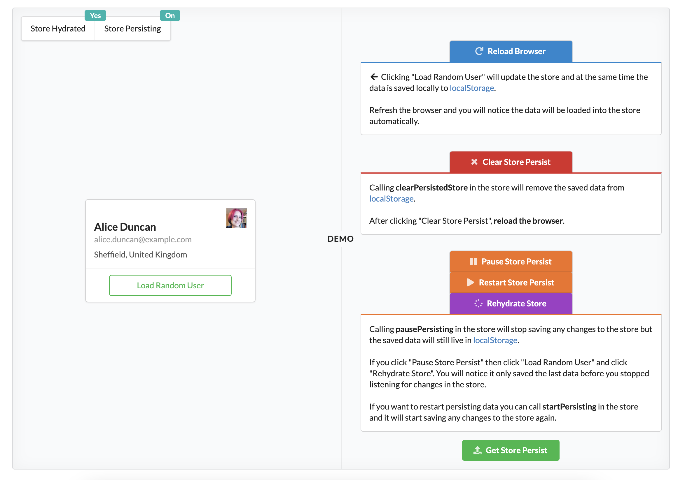

<h1 align="center">Mobx Persist Store</h1>
<h4 align="center">A simple way to persist and rehydrate observable properties in mobx stores</h4>
<div align="center">
	<a href="https://yarn.pm/mobx-persist-store"></a>
	<a href="https://npm-stat.com/charts.html?package=mobx-persist-store&from=2016-02-12"></a>
</div>
<div align="center">:star: Star us on GitHub — it helps!</div>

## Table of content

- [Installation](#installation)
- [Demo](#demo)
- [Getting Started](#getting-started)
- [Simple Example](#simple-example)
- [Example With SerializableProperties](#example-with-serializableproperties)
- [Example With All Options](#example-with-all-options)
- [Global Configuration](#global-configuration)
- [API](#api)
  - [makePersistable](#makepersistable)
  - [StorageOptions & ReactionOptions](#storageoptions--reactionoptions)
  - [isHydrated](#ishydrated)
  - [isPersisting](#ispersisting)
  - [pausePersisting](#pausepersisting)
  - [startPersisting](#startpersisting)
  - [stopPersisting](#stoppersisting)
  - [hydrateStore](#hydratestore-promise)
  - [clearPersistedStore](#clearpersistedstore-promise)
  - [getPersistedStore](#getpersistedstore-promise)
  - [PersistStoreMap](#persiststoremap)
- [Links](#links)

## Installation

```text
# by yarn
yarn add mobx-persist-store

# OR by npm
npm i mobx-persist-store
```

## Demo

<a href="https://codesandbox.io/s/mobx-persist-store-version-1-f852w?file=/src/stores/User.store.ts&theme=dark" target="_blank">Mobx Persist Store with MobX 6</a>
<a href="https://codesandbox.io/s/mobx-persist-store-version-1-f852w?file=/src/stores/User.store.ts&theme=dark" target="_blank"></a>

## Getting Started

```javascript
makePersistable(this, { name: 'SampleStore', properties: ['someProperty'], storage: window.localStorage });
```

To simply persist your MobX store use `makePersistable`. Pass a reference of the store (`this`) as the first argument.
The second argument is the [StorageOptions](#storageoptions--reactionoptions) for persisting the store data.
In the example below `name`, `properties`, and `storage` properties are required but if you use [configurePersistable](#global-configuration) you can set a global storage adapter, so you only have to set it once.
You can also pass a third argument ([ReactionOptions](#storageoptions--reactionoptions)) to control when data should be saved.

Hydration of the store will happen automatically when `makePersistable` is created.

### Simple Example

```javascript
import { makeAutoObservable } from 'mobx';
import { makePersistable } from 'mobx-persist-store';

export class SampleStore {
  someProperty: [];

  constructor() {
    makeAutoObservable(this);

    makePersistable(this, { name: 'SampleStore', properties: ['someProperty'], storage: window.localStorage });
  }
}
```

### Example With SerializableProperties

```javascript
import { makeAutoObservable } from 'mobx';
import { makePersistable } from 'mobx-persist-store';

export class SampleStore {
  someProperty: ['a', 'b', 'c'];

  constructor() {
    makeAutoObservable(this);

    makePersistable(this, {
      name: 'SampleStore',
      properties: [
        {
          key: 'someProperty',
          serialize: (value) => {
            return value.join(',');
          },
          deserialize: (value) => {
            return value.split(',');
          },
        },
      ],
      storage: window.localStorage,
    });
  }
}
```

### Example With All Options

```javascript
import { makePersistable } from 'mobx-persist-store';
import localForage from "localforage";

...
makePersistable(
  this,
  {
    name: 'SampleStore',
    properties: ['someProperty'],
    storage: localForage,  // localForage, window.localStorage, AsyncStorage all have the same interface
    expireIn: 86400000, // One day in milliseconds
    removeOnExpiration: true,
    stringify: false,
    debugMode: true,
  },
  { delay: 200, fireImmediately: false },
);
...
```

## Global Configuration

If you plan on using the same values for some options you can set them globally with the `configurePersistable`.

```javascript
import { configurePersistable } from 'mobx-persist-store';

// All properties are optional
configurePersistable(
  {
    storage: window.localStorage,
    expireIn: 86400000,
    removeOnExpiration: true,
    stringify: false,
    debugMode: true,
  },
  { delay: 200, fireImmediately: false }
);
```

```javascript
export class SampleStore {
  someProperty: [];

  constructor() {
    makeAutoObservable(this);

    // Now makePersistable only needs `name` and `properties`:
    makePersistable(this, { name: 'SampleStore', properties: ['someProperty'] });
  }
}
```

`configurePersistable` sets items globally, but you can override them within `makePersistable`.

## API

You should only need `makePersistable` but this library also provides other utils for more advance usage.

#### makePersistable (Promise)

> **makePersistable** sets up store persisting.
>
> ```javascript
> import { makeAutoObservable } from 'mobx';
> import { makePersistable } from 'mobx-persist-store';
>
> class SampleStore {
>   someProperty: [];
>
>   constructor() {
>     makeAutoObservable(this);
>
>     makePersistable(this, { name: 'SampleStore', properties: ['someProperty'] });
>   }
> }
> ```
>
> `makePersistable` is a Promise, so you can determine when the store has been initially hydrated. Also, you can use [isHydrated](#ishydrated) to determine the hydration state.
>
> ```javascript
> import { makeAutoObservable, action } from 'mobx';
> import { makePersistable } from 'mobx-persist-store';
> ...
>     makePersistable(this, { name: 'SampleStore', properties: ['someProperty'] }).then(
>       action((persistStore) => {
>         console.log(persistStore.isHydrated);
>       })
>     );
> ...
> ```

#### StorageOptions & ReactionOptions

> **StorageOptions**
>
> - `name` (String) - Should be a unique identifier and will be used as the key for the data storage.
> - `properties` (Array of String) - A list of observable properties on the store you want to persist. Doesn't save MobX actions or computed values.
> - `storage` ([localStorage Like API](https://hacks.mozilla.org/2009/06/localstorage/)) - Facilitates the reading, writing, and removal of the persisted store data. For **ReactNative** it may be `AsyncStorage`, `FS`, etc. and for **React** - `localStorage`, `sessionStorage`, `localForage` etc.
>   - If you have an app that is Server-side rendering (SSR) you can set the value `undefined` to prevent errors.
> - `expireIn` (Number) - A value in milliseconds to determine when the data in storage should not be retrieved by getItem. Never expires by default.
> - `removeOnExpiration` (Boolean) - If expireIn has a value and has expired, the data in storage will be removed automatically when getItem is called. The default value is true.
> - `stringify` (Boolean) - When true the data will be JSON.stringify before being passed to setItem. The default value is true.
> - `debugMode` (Boolean) - When true a console.info will be called for several of mobx-persist-store items. The default value is false.
>
> **ReactionOptions** [MobX Reactions Options](https://mobx.js.org/reactions.html#options-)
>
> - `delay` (Number) - Allows you to set a `delay` option to limit the amount of times the `write` function is called. No delay by default.
>   - For example if you have a `200` millisecond delay and two changes happen within the delay time then the `write` function is only called once. If you have no delay then the `write` function would be called twice.
> - `fireImmediately` (Boolean) - Determines if the store data should immediately be persisted or wait until a property in store changes. `false` by default.
>
> ```javascript
> configurePersistable(
>   {
>     storage: window.localStorage,
>     expireIn: 86400000,
>     removeOnExpiration: true,
>     stringify: false,
>     debugMode: true,
>   },
>   { delay: 200, fireImmediately: false }
> );
> ...
> makePersistable(
>   this,
>   {
>     name: 'SampleStore',
>     properties: ['someProperty'],
>     storage: window.localStorage,
>     expireIn: 86400000,
>     removeOnExpiration: true,
>     stringify: false,
>     debugMode: true,
>   },
>   { delay: 200, fireImmediately: false }
> );
> ```

#### isHydrated

> **isHydrated** will be `true` once the store has finished being updated with the persisted data.
>
> ```javascript
> import { makeAutoObservable } from 'mobx';
> import { makePersistable, isHydrated } from 'mobx-persist-store';
>
> class SampleStore {
>   someProperty: [];
>
>   constructor() {
>     makeAutoObservable(this, {}, { autoBind: true });
>     makePersistable(this, { name: 'SampleStore', properties: ['someProperty'] });
>   }
>
>   get isHydrated() {
>     return isHydrated(this);
>   }
> }
> ```

#### isPersisting

> **isPersisting** determines if the store is being currently persisted.
> When calling `pausePersisting` the value will be `false` and `true` with `startPersisting` is called.
>
> ```javascript
> import { makeAutoObservable } from 'mobx';
> import { makePersistable, isPersisting } from 'mobx-persist-store';
>
> class SampleStore {
>   someProperty: [];
>
>   constructor() {
>     makeAutoObservable(this, {}, { autoBind: true });
>     makePersistable(this, { name: 'SampleStore', properties: ['someProperty'] });
>   }
>
>   get isPersisting() {
>     return isPersisting(this);
>   }
> }
> ```

#### pausePersisting

> **pausePersisting** pauses the store from persisting data.
>
> ```javascript
> import { makeAutoObservable } from 'mobx';
> import { makePersistable, pausePersisting } from 'mobx-persist-store';
>
> class SampleStore {
>   someProperty: [];
>
>   constructor() {
>     makeAutoObservable(this, {}, { autoBind: true });
>     makePersistable(this, { name: 'SampleStore', properties: ['someProperty'] });
>   }
>
>   pauseStore() {
>     pausePersisting(this);
>   }
> }
> ```

#### startPersisting

> **startPersisting** starts persisting the store data again after `pausePersisting` was called.
>
> ```javascript
> import { makeAutoObservable } from 'mobx';
> import { makePersistable, startPersisting } from 'mobx-persist-store';
>
> class SampleStore {
>   someProperty: [];
>
>   constructor() {
>     makeAutoObservable(this, {}, { autoBind: true });
>     makePersistable(this, { name: 'SampleStore', properties: ['someProperty'] });
>   }
>
>   startStore() {
>     startPersisting(this);
>   }
> }
> ```

#### stopPersisting

> **stopPersisting** calls `pausePersisting` and internally removes reference to the store.
> You should only call this function if you have store(s) that are re-created or do not live for the entire life of your application.
>
> ```javascript
> import { makeAutoObservable } from 'mobx';
> import { makePersistable, stopPersisting } from 'mobx-persist-store';
>
> class SampleStore {
>   someProperty: [];
>
>   constructor() {
>     makeAutoObservable(this, {}, { autoBind: true });
>     makePersistable(this, { name: 'SampleStore', properties: ['someProperty'] });
>   }
>
>   stopStore() {
>     stopPersisting(this);
>   }
> }
> ```
>
> This function prevents memory leaks when you have store(s) that are removed or re-crated.
> In the React example below `stopPersisting` is called when the component is unmounted.
>
> ```javascript
> import React, { useEffect, useState } from 'react';
> import { observer } from 'mobx-react-lite';
> import { stopPersisting } from 'mobx-persist-store';
>
> export const SamplePage = observer(() => {
>   const [localStore] = useState(() => new SampleStore());
>
>   useEffect(() => {
>     // Called when the component is unmounted
>     return () => localStore.stopStore();
>   }, []);
>
>   return (
>     <div>
>       {localStore.someProperty.map((item) => (
>         <div key={item.name}>{item.name}</div>
>       ))}
>     </div>
>   );
> });
> ```

#### hydrateStore (Promise)

> **hydrateStore** will update the store with the persisted data. This will happen automatically with the initial `makePersistable` call.
> This function is provide to manually hydrate the store. You should not have to call it unless you are doing something that modified the persisted data outside the store.
>
> ```javascript
> import { makeAutoObservable } from 'mobx';
> import { makePersistable, hydrateStore } from 'mobx-persist-store';
>
> class SampleStore {
>   someProperty: [];
>
>   constructor() {
>     makeAutoObservable(this, {}, { autoBind: true });
>     makePersistable(this, { name: 'SampleStore', properties: ['someProperty'] });
>   }
>
>   async hydrateStore() {
>     await hydrateStore(this);
>   }
> }
> ```

#### clearPersistedStore (Promise)

> **clearPersistedStore** will remove the persisted data. This function is provide to manually clear the store's persisted data.
>
> ```javascript
> import { makeAutoObservable } from 'mobx';
> import { makePersistable, clearPersistedStore } from 'mobx-persist-store';
>
> class SampleStore {
>   someProperty: [];
>
>   constructor() {
>     makeAutoObservable(this, {}, { autoBind: true });
>     makePersistable(this, { name: 'SampleStore', properties: ['someProperty'] });
>   }
>
>   async clearStoredDate() {
>     await clearPersistedStore(this);
>   }
> }
> ```

#### getPersistedStore (Promise)

> **getPersistedStore** will get the persisted data. This function is provide to manually get the store's persisted data.
>
> ```javascript
> import { makeAutoObservable } from 'mobx';
> import { makePersistable, getPersistedStore } from 'mobx-persist-store';
>
> class SampleStore {
>   someProperty: [];
>
>   constructor() {
>     makeAutoObservable(this, {}, { autoBind: true });
>     makePersistable(this, { name: 'SampleStore', properties: ['someProperty'] });
>   }
>
>   async getStoredData() {
>     return getPersistedStore(this);
>   }
> }
> ```

#### PersistStoreMap

> **PersistStoreMap** is a JavaScript Map object where the key is a reference to the store, and the value is a reference to the persist store.
> Note: calling `stopPersisting(this)` will remove the store and persist store references from PersistStoreMap to prevent memory leaks.
>
> ```javascript
> import { PersistStoreMap } from 'mobx-persist-store';
>
> Array.from(PersistStoreMap.values()).map((persistStore) => persistStore.getPersistedStore());
> ```

## Links

- [MobX Site](https://mobx.js.org/README.html)
